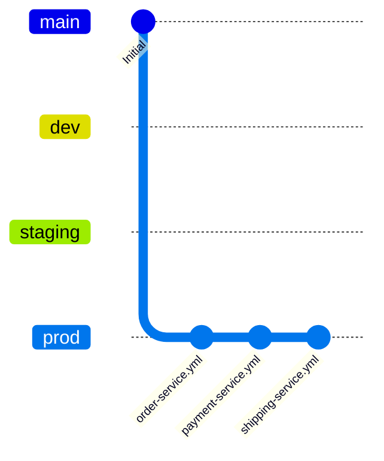
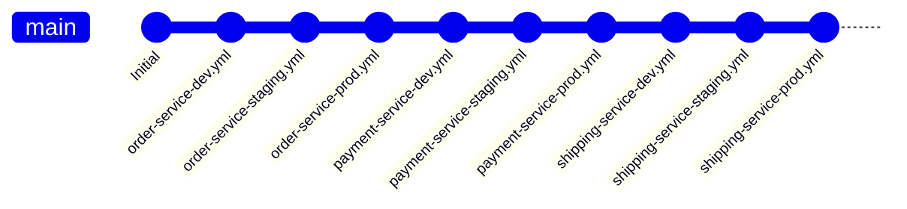
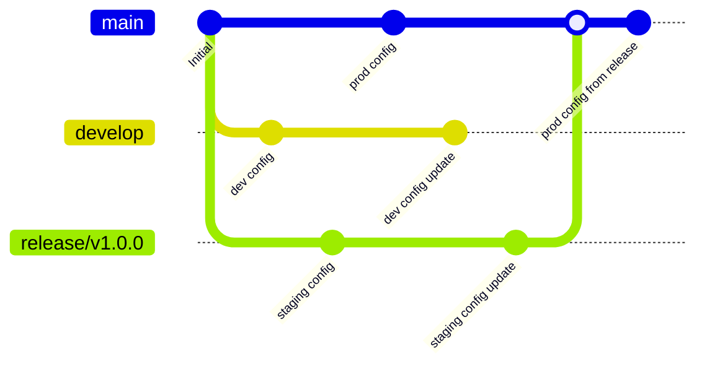
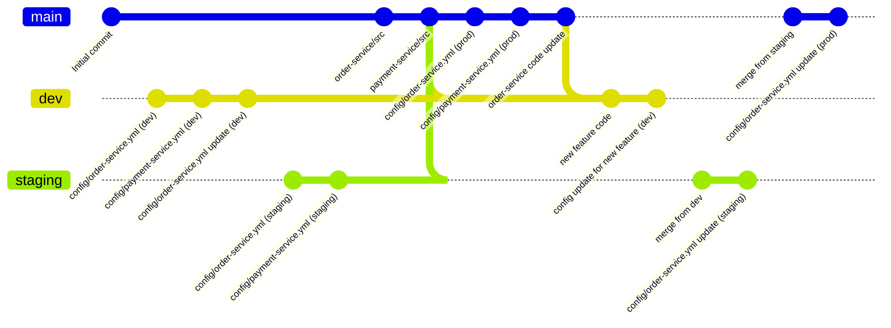
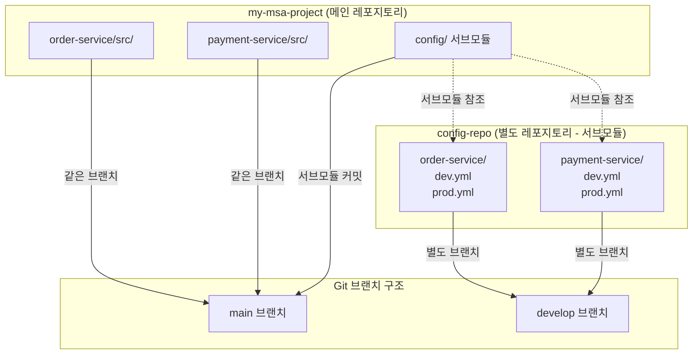

# Spring Cloud Config Server와 Git 브랜치 전략: 멀티 모듈 MSA 환경에서의 설정 관리

이전 글에서 로컬 Kubernetes 환경(kind, minikube, k3d, k3s)을 비교해봤는데, 이번에는 마이크로서비스 아키텍처(MSA)를 구성할 때 **설정 관리**에 대해 정리해보겠습니다.

마이크로서비스 아키텍처(MSA)를 구성할 때, **설정 관리**는 가장 중요한 고민 중 하나입니다.  
특히 **Spring Cloud Config Server**를 사용하여 Git 저장소의 YAML 파일들을 참조하는 경우, **"어떤 브랜치 전략을 사용해야 할까?"**라는 질문이 자연스럽게 떠오릅니다.

이 글에서는 **하나의 레포지토리에 멀티 모듈 형식으로 MSA를 구성**하고, **Spring Cloud Config Server가 Git의 yml 파일들을 참조**하는 환경에서 발생하는 브랜치 전략 고민을 정리해보겠습니다.

**중요한 개념:**
- **애플리케이션 코드 레포지토리**: 멀티 모듈로 구성된 서비스들의 소스 코드가 있는 레포지토리
- **config-repo (설정 레포지토리)**: Spring Cloud Config Server가 참조하는 **설정 파일만 저장하는 별도의 Git 레포지토리**

이 두 레포지토리는 **분리**되어 있으며, Config Server는 설정 레포지토리에서만 설정 파일을 읽어옵니다.

---

## 1. 문제 상황: Spring Cloud Config Server와 Git 기반 설정

### Spring Cloud Config Server의 동작 방식

**Spring Cloud Config Server**는 외부 설정 저장소(예: Git)에서 설정 파일을 읽어와서 마이크로서비스에 제공하는 중앙화된 설정 서버입니다.

**전체 아키텍처 다이어그램:**
```
┌─────────────────────────────────────────────────────────┐
│              애플리케이션 코드 레포지토리                  │
│              (my-msa-project)                            │
│  ┌──────────────┐  ┌──────────────┐  ┌──────────────┐  │
│  │order-service │  │payment-service│  │shipping-service│ │
│  │  (멀티 모듈)  │  │  (멀티 모듈)  │  │  (멀티 모듈)  │  │
│  └──────────────┘  └──────────────┘  └──────────────┘  │
└─────────────────────────────────────────────────────────┘
                        │
                        │ 설정 요청
                        ▼
┌─────────────────────────────────────────────────────────┐
│           Spring Cloud Config Server                    │
│           (8888)                                        │
│                                                         │
│  ┌──────────────────────────────────────────────┐     │
│  │  Git 저장소에서 설정 파일 읽기                │     │
│  │  - order-service-dev.yml                      │     │
│  │  - payment-service-prod.yml                  │     │
│  └──────────────────────────────────────────────┘     │
└─────────────────────────────────────────────────────────┘
                        │
                        │ Git에서 읽기
                        ▼
┌─────────────────────────────────────────────────────────┐
│              설정 레포지토리 (config-repo)              │
│              별도 Git 저장소                             │
│  ┌──────────────┐  ┌──────────────┐  ┌──────────────┐ │
│  │order-service/│  │payment-service│  │shipping-service││
│  │├─ dev.yml    │  │├─ dev.yml    │  │├─ dev.yml    │ │
│  │├─ staging.yml│  │├─ staging.yml│  │├─ staging.yml│ │
│  │└─ prod.yml   │  │└─ prod.yml   │  │└─ prod.yml   │ │
│  └──────────────┘  └──────────────┘  └──────────────┘ │
└─────────────────────────────────────────────────────────┘
```

**레포지토리 구조:**
```
# 애플리케이션 코드 레포지토리 (예: my-msa-project)
my-msa-project/
├── order-service/          # 멀티 모듈
├── payment-service/        # 멀티 모듈
└── shipping-service/       # 멀티 모듈

# 설정 레포지토리 (예: config-repo) - 별도 레포지토리
config-repo/
├── order-service/
│   ├── order-service-dev.yml
│   └── order-service-prod.yml
├── payment-service/
│   ├── payment-service-dev.yml
│   └── payment-service-prod.yml
└── shipping-service/
    ├── shipping-service-dev.yml
    └── shipping-service-prod.yml
```

```yaml
# Config Server의 application.yml
spring:
  cloud:
    config:
      server:
        git:
          uri: https://github.com/org/config-repo.git
          default-label: main  # 기본 브랜치
          search-paths: 
            - '{application}'  # 서비스별 디렉토리
```

**동작 흐름:**
1. 마이크로서비스가 시작될 때 Config Server에 설정 요청
2. Config Server가 Git 저장소에서 `{application}-{profile}.yml` 파일을 찾아서 반환
3. 예: `order-service-dev.yml`, `payment-service-prod.yml` 등

### 멀티 모듈 MSA 환경의 특징

```
config-repo/
├── order-service/
│   ├── order-service-dev.yml
│   ├── order-service-staging.yml
│   └── order-service-prod.yml
├── payment-service/
│   ├── payment-service-dev.yml
│   ├── payment-service-staging.yml
│   └── payment-service-prod.yml
└── shipping-service/
    ├── shipping-service-dev.yml
    ├── shipping-service-staging.yml
    └── shipping-service-prod.yml
```

**문제점:**
- **하나의 Git 저장소**에 **여러 서비스의 설정 파일**이 모두 들어있음
- **환경별(dev/staging/prod) 설정**을 어떻게 관리할 것인가?
- **브랜치 전략**이 설정 파일 관리와 어떻게 연동되는가?

---

## 2. 브랜치 전략 선택지

### 전략 1: 환경별 브랜치 전략 (Branch per Environment)

**개념:**
- 각 환경마다 별도의 브랜치를 유지
- `dev`, `staging`, `prod` 브랜치에 각각 해당 환경의 설정 파일만 존재

**브랜치 구조 다이어그램 (Mermaid GitGraph):**



**브랜치 구조 다이어그램 (텍스트):**
```
                    config-repo (Git 저장소)
                            │
        ┌───────────────────┼───────────────────┐
        │                   │                   │
     dev 브랜치        staging 브랜치        prod 브랜치
        │                   │                   │
        ├─ order-service/   ├─ order-service/   ├─ order-service/
        │  └─ order-service │  └─ order-service │  └─ order-service
        │     .yml          │     .yml          │     .yml
        │                   │                   │
        ├─ payment-service/ ├─ payment-service/ ├─ payment-service/
        │  └─ payment-     │  └─ payment-     │  └─ payment-
        │     service.yml   │     service.yml   │     service.yml
        │                   │                   │
        └─ shipping-service/└─ shipping-service/└─ shipping-service/
           └─ shipping-      └─ shipping-      └─ shipping-
              service.yml        service.yml        service.yml
```

**파일 구조:**
```
config-repo/
├── dev (브랜치)
│   ├── order-service/order-service.yml
│   ├── payment-service/payment-service.yml
│   └── shipping-service/shipping-service.yml
├── staging (브랜치)
│   ├── order-service/order-service.yml
│   ├── payment-service/payment-service.yml
│   └── shipping-service/shipping-service.yml
└── prod (브랜치)
    ├── order-service/order-service.yml
    ├── payment-service/payment-service.yml
    └── shipping-service/shipping-service.yml
```

**Config Server 설정:**
```yaml
spring:
  cloud:
    config:
      server:
        git:
          uri: https://github.com/org/config-repo.git
          # 환경별로 다른 브랜치를 참조하도록 설정
          # 또는 Config Server 자체를 환경별로 분리
```

**장점:**
- ✅ **환경 간 격리**: dev 설정이 실수로 prod에 반영될 위험이 적음
- ✅ **권한 관리**: prod 브랜치에 대한 접근 권한을 엄격하게 제어 가능
- ✅ **배포 파이프라인 연동**: 환경별로 다른 브랜치를 체크아웃하여 배포

**단점:**
- ❌ **설정 파일 중복**: 같은 설정을 여러 브랜치에 유지해야 함
- ❌ **동기화 문제**: dev에서 변경한 설정을 staging/prod에 반영하는 과정이 수동적
- ❌ **병합 복잡도**: 브랜치 간 병합 시 충돌 가능성

---

### 전략 2: 단일 브랜치 + Profile 기반 전략 (Single Branch with Profiles)

**개념:**
- **하나의 브랜치(main)**에 모든 환경의 설정 파일을 함께 관리
- 파일명에 profile을 포함: `{application}-{profile}.yml`

**브랜치 구조 다이어그램 (Mermaid GitGraph):**



**브랜치 구조 다이어그램 (텍스트):**
```
                    config-repo (Git 저장소)
                            │
                    main 브랜치 (단일 브랜치)
                            │
        ┌───────────────────┼───────────────────┐
        │                   │                   │
   order-service/    payment-service/    shipping-service/
        │                   │                   │
        ├─ order-service-   ├─ payment-service- ├─ shipping-service-
        │  dev.yml          │  dev.yml          │  dev.yml
        │                   │                   │
        ├─ order-service-   ├─ payment-service- ├─ shipping-service-
        │  staging.yml       │  staging.yml      │  staging.yml
        │                   │                   │
        └─ order-service-   └─ payment-service- └─ shipping-service-
           prod.yml             prod.yml             prod.yml
```

**파일 구조:**
```
config-repo/main (브랜치)
├── order-service/
│   ├── order-service-dev.yml
│   ├── order-service-staging.yml
│   └── order-service-prod.yml
├── payment-service/
│   ├── payment-service-dev.yml
│   ├── payment-service-staging.yml
│   └── payment-service-prod.yml
└── shipping-service/
    ├── shipping-service-dev.yml
    ├── shipping-service-staging.yml
    └── shipping-service-prod.yml
```

**Config Server 설정:**
```yaml
spring:
  cloud:
    config:
      server:
        git:
          uri: https://github.com/org/config-repo.git
          default-label: main
          search-paths: 
            - '{application}'
```

**마이크로서비스 설정:**
```yaml
# order-service의 bootstrap.yml
spring:
  application:
    name: order-service
  profiles:
    active: dev  # 또는 staging, prod
  config:
    import: optional:configserver:http://config-server:8888
```

**장점:**
- ✅ **단순함**: 하나의 브랜치에서 모든 설정을 관리
- ✅ **비교 용이**: 환경별 설정 차이를 Git diff로 쉽게 확인 가능
- ✅ **자동화 친화적**: CI/CD 파이프라인에서 단일 브랜치만 체크아웃하면 됨

**단점:**
- ❌ **실수 위험**: dev 설정을 수정하다가 prod 설정을 건드릴 수 있음
- ❌ **권한 관리 제한**: 파일 단위 권한은 Git에서 직접 지원하지 않음 (GitHub/GitLab의 파일 경로 기반 권한 필요)
- ❌ **배포 시점 제어**: 특정 환경만 배포하기 어려움 (모든 환경 설정이 함께 배포됨)

---

### 전략 3: Git Flow + 환경별 브랜치 하이브리드

**개념:**
- **개발 브랜치(develop)**: dev 환경 설정
- **릴리스 브랜치(release)**: staging 환경 설정
- **메인 브랜치(main)**: prod 환경 설정

**브랜치 구조 다이어그램 (Mermaid GitGraph):**



```
config-repo/
├── develop (브랜치) → dev 환경
│   └── order-service/order-service.yml
├── release/* (브랜치) → staging 환경
│   └── order-service/order-service.yml
└── main (브랜치) → prod 환경
    └── order-service/order-service.yml
```

**Config Server 설정 (환경별로 다른 인스턴스):**
```yaml
# Config Server (dev)
spring:
  cloud:
    config:
      server:
        git:
          uri: https://github.com/org/config-repo.git
          default-label: develop

# Config Server (staging)
spring:
  cloud:
    config:
      server:
        git:
          uri: https://github.com/org/config-repo.git
          default-label: release/v1.0.0

# Config Server (prod)
spring:
  cloud:
    config:
      server:
        git:
          uri: https://github.com/org/config-repo.git
          default-label: main
```

**장점:**
- ✅ **Git Flow와 자연스럽게 연동**: 개발 → 릴리스 → 프로덕션 흐름과 설정 관리가 일치
- ✅ **환경별 격리**: 각 환경이 다른 브랜치를 참조
- ✅ **릴리스 프로세스**: release 브랜치에서 staging 테스트 후 main으로 병합

**단점:**
- ❌ **복잡도**: 브랜치 관리가 복잡해질 수 있음
- ❌ **Config Server 인스턴스**: 환경별로 Config Server를 분리해야 함 (또는 동적 브랜치 선택 필요)

---

## 3. 멀티 모듈 MSA 환경에서의 실전 고려사항

### 고려사항 1: 서비스별 독립 배포

**문제:**
- 멀티 모듈로 구성되어 있지만, 각 서비스는 **독립적으로 배포**되어야 함
- order-service만 배포할 때, payment-service 설정 파일까지 함께 배포되는 것은 비효율적

**해결 방안:**
- **서비스별 디렉토리 분리**: 각 서비스의 설정을 별도 디렉토리로 관리
- **Config Server의 search-paths 활용**: `{application}` 기반으로 필요한 서비스만 로드

```yaml
spring:
  cloud:
    config:
      server:
        git:
          search-paths: 
            - '{application}'  # order-service 요청 시 order-service/ 디렉토리만 검색
```

---

### 고려사항 2: 공통 설정 vs 서비스별 설정

**문제:**
- 여러 서비스가 공유하는 설정(예: Kafka broker 주소, DB 연결 정보)과 서비스별 고유 설정을 어떻게 분리할까?

**해결 방안:**
- **공통 설정 파일**: `application-{profile}.yml` (모든 서비스가 공유)
- **서비스별 설정**: `{application}-{profile}.yml` (서비스 고유 설정)
- **설정 우선순위**: Spring Boot의 설정 우선순위에 따라 서비스별 설정이 공통 설정을 오버라이드

```
config-repo/
├── application-dev.yml      # 공통 설정 (모든 서비스)
├── application-prod.yml    # 공통 설정 (모든 서비스)
├── order-service/
│   ├── order-service-dev.yml   # order-service 전용 설정
│   └── order-service-prod.yml
└── payment-service/
    ├── payment-service-dev.yml # payment-service 전용 설정
    └── payment-service-prod.yml
```

---

### 고려사항 3: 설정 변경의 롤백

**문제:**
- 설정 파일을 잘못 수정했을 때, 어떻게 빠르게 롤백할 수 있을까?

**해결 방안:**
- **Git 태그 활용**: 중요한 설정 변경 시점에 태그를 달아두기
- **Config Server의 refresh 기능**: `/actuator/refresh` 엔드포인트로 설정 재로드 (Git에서 최신 커밋 가져오기)
- **브랜치 기반 롤백**: 문제 발생 시 이전 브랜치/커밋으로 Config Server가 참조하도록 변경

```bash
# Config Server가 특정 커밋을 참조하도록 설정
spring:
  cloud:
    config:
      server:
        git:
          default-label: v1.2.3  # 태그 또는 커밋 해시
```

---

## 4. 추천 브랜치 전략: 상황별 가이드

### 소규모 팀 + 빠른 개발 속도가 중요할 때

**추천: 전략 2 (단일 브랜치 + Profile 기반)**

- 이유: 설정 관리가 단순하고, 환경별 차이를 한눈에 비교하기 쉬움
- 주의사항: PR 리뷰 시 prod 설정 변경을 꼼꼼히 확인

```yaml
# Config Server
spring:
  cloud:
    config:
      server:
        git:
          uri: https://github.com/org/config-repo.git
          default-label: main
```

---

### 대규모 팀 + 환경별 권한 분리가 중요할 때

**추천: 전략 1 (환경별 브랜치)**

- 이유: prod 브랜치에 대한 접근 권한을 엄격하게 제어 가능
- 주의사항: 설정 동기화 프로세스를 명확히 정의 (예: dev → staging → prod 승인 워크플로우)

```yaml
# Config Server (환경별로 다른 인스턴스 또는 동적 브랜치 선택)
spring:
  cloud:
    config:
      server:
        git:
          uri: https://github.com/org/config-repo.git
          default-label: ${CONFIG_BRANCH:dev}  # 환경 변수로 브랜치 지정
```

---

### 릴리스 프로세스가 체계화되어 있을 때

**추천: 전략 3 (Git Flow + 환경별 브랜치)**

- 이유: 코드 배포 프로세스와 설정 관리 프로세스가 일치
- 주의사항: 브랜치 전략이 복잡해지므로 팀 내 문서화 필요

---

## 5. 실전 구현 예시: 단일 브랜치 + Profile 기반

### Git 저장소 구조

```
config-repo/
├── .github/
│   └── workflows/
│       └── validate-config.yml  # 설정 파일 검증 CI
├── order-service/
│   ├── order-service-dev.yml
│   ├── order-service-staging.yml
│   └── order-service-prod.yml
├── payment-service/
│   ├── payment-service-dev.yml
│   ├── payment-service-staging.yml
│   └── payment-service-prod.yml
├── application-dev.yml      # 공통 설정
├── application-staging.yml  # 공통 설정
└── application-prod.yml     # 공통 설정
```

### Config Server 설정

```yaml
# config-server/src/main/resources/application.yml
server:
  port: 8888

spring:
  application:
    name: config-server
  cloud:
    config:
      server:
        git:
          uri: https://github.com/org/config-repo.git
          default-label: main
          search-paths:
            - '{application}'
          clone-on-start: true  # 시작 시 Git 클론
          force-pull: true      # 매 요청마다 최신 커밋 가져오기
```

### 마이크로서비스 설정

```yaml
# order-service/src/main/resources/bootstrap.yml
spring:
  application:
    name: order-service
  profiles:
    active: ${SPRING_PROFILES_ACTIVE:dev}  # 환경 변수로 profile 지정
  config:
    import: optional:configserver:http://config-server:8888
```

### 환경별 배포 시 설정

```bash
# dev 환경
SPRING_PROFILES_ACTIVE=dev java -jar order-service.jar

# staging 환경
SPRING_PROFILES_ACTIVE=staging java -jar order-service.jar

# prod 환경
SPRING_PROFILES_ACTIVE=prod java -jar order-service.jar
```

---

## 6. 보안 및 권한 관리

### 파일 경로 기반 권한 (GitHub/GitLab)

**GitHub:**
- `CODEOWNERS` 파일을 사용하여 특정 경로의 파일 변경 시 리뷰어 지정
- Branch protection rules로 prod 관련 파일 변경 시 승인 필수

```
# .github/CODEOWNERS
/prod/ @infra-team
/*-prod.yml @infra-team @tech-lead
```

**GitLab:**
- Protected branches + 파일 경로 기반 권한 설정
- Merge request approval rules

---

### 시크릿 관리

**주의사항:**
- **절대 Git에 민감 정보(비밀번호, API 키)를 직접 커밋하지 말 것**
- 대안: **HashiCorp Vault**, **AWS Secrets Manager**, **Kubernetes Secrets** 등과 연동

```yaml
# ❌ 나쁜 예: 비밀번호를 직접 작성
spring:
  datasource:
    password: my-secret-password

# ✅ 좋은 예: 환경 변수 또는 Vault 참조
spring:
  datasource:
    password: ${DB_PASSWORD}  # 환경 변수
    # 또는
    password: ${vault.database.password}  # Vault 연동
```

---

## 7. 모니터링 및 운영

### Config Server 헬스 체크

```yaml
# Config Server에 actuator 추가
management:
  endpoints:
    web:
      exposure:
        include: health,info,refresh
  endpoint:
    health:
      show-details: always
```

### 설정 변경 알림

**방법 1: 수동 Refresh**
- 설정 파일 변경 후 각 서비스의 `/actuator/refresh` 엔드포인트를 수동으로 호출
- 단점: 서비스가 많을수록 번거로움

**방법 2: GitHub/GitLab Webhook**
- **GitHub Webhook** 또는 **GitLab Webhook**을 Config Server에 연동
- 설정 파일 변경 시 Config Server가 자동으로 최신 커밋을 가져오도록 설정
- 각 서비스는 여전히 `/actuator/refresh`를 수동으로 호출해야 함

**방법 3: Spring Cloud Bus (권장)**
- **Spring Cloud Bus**는 메시지 브로커(Kafka, RabbitMQ 등)를 통해 설정 변경을 **모든 서비스에 자동으로 브로드캐스트**
- Config Server에서 `/actuator/bus-refresh`를 호출하면, 연결된 모든 서비스가 자동으로 설정을 갱신
- **Spring Cloud Bus에 대한 자세한 내용은 별도 글로 정리하겠습니다.**

---

## 8. 번외: 코드 레포지토리와 설정 레포지토리를 함께 사용하는 경우

### 상황: Monorepo 접근 방식

앞서 설명한 내용은 **코드 레포지토리와 설정 레포지토리를 분리**하는 방식을 기준으로 했습니다.  
하지만 실제로는 **하나의 레포지토리에 코드와 설정을 함께 관리**하는 경우도 있습니다.

**Monorepo 구조 다이어그램 (Mermaid Flowchart):**

```mermaid
graph TB
    subgraph "my-msa-project (하나의 레포지토리)"
        A1[order-service/<br/>src/<br/>소스 코드]
        A2[payment-service/<br/>src/<br/>소스 코드]
        A3[shipping-service/<br/>src/<br/>소스 코드]
        B[config/<br/>설정 파일 디렉토리]
        B1[order-service/<br/>dev.yml<br/>prod.yml]
        B2[payment-service/<br/>dev.yml<br/>prod.yml]
        B3[shipping-service/<br/>dev.yml<br/>prod.yml]
        B --> B1
        B --> B2
        B --> B3
    end
    
    subgraph "Spring Cloud Config Server"
        C[Config Server<br/>:8888]
        C1[config/{application}<br/>에서 설정 읽기]
        C --> C1
    end
    
    A1 -->|설정 요청| C
    A2 -->|설정 요청| C
    A3 -->|설정 요청| C
    C1 -->|Git에서 읽기| B
```

**레포지토리 구조:**
```
my-msa-project/  # 하나의 레포지토리
├── order-service/
│   ├── src/                    # 소스 코드
│   └── order-service-dev.yml   # 설정 파일
├── payment-service/
│   ├── src/                    # 소스 코드
│   └── payment-service-dev.yml # 설정 파일
└── config/                     # 또는 별도 config 디렉토리
    ├── order-service/
    │   ├── order-service-dev.yml
    │   └── order-service-prod.yml
    └── payment-service/
        ├── payment-service-dev.yml
        └── payment-service-prod.yml
```

### 브랜치 전략 고려사항

**문제점:**
- 코드 변경과 설정 변경이 **같은 레포지토리**에 있음
- 코드 배포와 설정 배포의 **타이밍이 다를 수 있음**
- 설정 변경이 코드 변경과 **독립적으로 배포**되어야 할 수 있음

### 전략 1: Git Flow + 설정 디렉토리 분리

**개념:**
- 코드와 설정을 **같은 브랜치**에서 관리하되, **디렉토리로 분리**
- 설정 파일은 `config/` 디렉토리에 모아서 관리

```
my-msa-project/
├── order-service/src/           # 코드
├── payment-service/src/        # 코드
└── config/                     # 설정 파일만 모음
    ├── order-service/
    │   ├── order-service-dev.yml
    │   └── order-service-prod.yml
    └── payment-service/
        ├── payment-service-dev.yml
        └── payment-service-prod.yml
```

**Config Server 설정:**
```yaml
spring:
  cloud:
    config:
      server:
        git:
          uri: https://github.com/org/my-msa-project.git
          default-label: main
          search-paths:
            - 'config/{application}'  # config 디렉토리 하위에서 검색
```

**장점:**
- ✅ 코드와 설정을 **하나의 레포지토리**에서 관리
- ✅ 코드 변경과 설정 변경의 **버전을 함께 추적** 가능
- ✅ PR 리뷰 시 코드와 설정을 **함께 확인** 가능

**단점:**
- ❌ 설정 변경 시 **코드 레포지토리에 커밋**해야 함
- ❌ 설정만 변경하려고 해도 **코드 레포지토리 접근 권한** 필요
- ❌ 설정 변경이 코드 변경과 **혼재**될 수 있음

---

### 전략 2: 환경별 브랜치 + 설정 디렉토리

**개념:**
- 환경별 브랜치(`dev`, `staging`, `prod`)를 사용
- 각 브랜치에 해당 환경의 설정 파일만 존재

**브랜치 구조 다이어그램 (Mermaid GitGraph):**



**레포지토리 구조:**
```
my-msa-project/
├── dev (브랜치)
│   ├── order-service/src/
│   ├── payment-service/src/
│   └── config/
│       ├── order-service/order-service.yml
│       └── payment-service/payment-service.yml
├── staging (브랜치)
│   ├── order-service/src/
│   ├── payment-service/src/
│   └── config/
│       ├── order-service/order-service.yml
│       └── payment-service/payment-service.yml
└── main (브랜치) - prod
    ├── order-service/src/
    ├── payment-service/src/
    └── config/
        ├── order-service/order-service.yml
        └── payment-service/payment-service.yml
```

**Config Server 설정 (환경별):**
```yaml
# Config Server (dev 환경)
spring:
  cloud:
    config:
      server:
        git:
          uri: https://github.com/org/my-msa-project.git
          default-label: dev
          search-paths:
            - 'config/{application}'

# Config Server (prod 환경)
spring:
  cloud:
    config:
      server:
        git:
          uri: https://github.com/org/my-msa-project.git
          default-label: main
          search-paths:
            - 'config/{application}'
```

**장점:**
- ✅ 환경별로 **완전히 분리**된 설정 관리
- ✅ prod 설정이 실수로 dev에 반영될 위험이 적음

**단점:**
- ❌ 코드 변경을 **여러 브랜치에 병합**해야 함
- ❌ 설정 동기화가 복잡함

---

### 전략 3: 설정 전용 서브모듈 또는 서브트리

**개념:**
- 설정 파일을 **Git 서브모듈(Submodule)** 또는 **서브트리(Subtree)**로 관리
- 코드 레포지토리와 설정 레포지토리를 **논리적으로 분리**하되, 물리적으로는 같은 레포지토리처럼 사용

**서브모듈 구조 다이어그램 (Mermaid Flowchart):**



**브랜치 구조 다이어그램 (Mermaid GitGraph):**

```mermaid
gitGraph
    commit id: "Initial commit"
    commit id: "order-service/src"
    commit id: "payment-service/src"
    commit id: "Add config submodule"
    commit id: "order-service code update"
    commit id: "config submodule update"
    commit id: "payment-service code update"
    commit id: "config submodule update"
    branch develop
    checkout develop
    commit id: "order-service new feature"
    commit id: "config submodule update"
    checkout main
    merge develop
    commit id: "Release v1.0.0"
```

**레포지토리 구조:**
```
my-msa-project/
├── order-service/src/
├── payment-service/src/
└── config/  # Git 서브모듈로 별도 레포지토리 참조
    ├── order-service/
    └── payment-service/
```

**Config Server 설정:**
```yaml
spring:
  cloud:
    config:
      server:
        git:
          uri: https://github.com/org/my-msa-project.git
          default-label: main
          search-paths:
            - 'config/{application}'
          # 서브모듈 자동 업데이트
          clone-on-start: true
```

**장점:**
- ✅ 설정 레포지토리를 **별도로 관리**할 수 있음 (서브모듈의 경우)
- ✅ 코드 레포지토리에서는 설정을 **참조만** 함

**단점:**
- ❌ Git 서브모듈/서브트리 관리가 복잡함
- ❌ 팀원들이 서브모듈 개념을 이해해야 함

---

### 실전 추천: 상황별 선택

**소규모 팀 + 빠른 개발:**
- **전략 1 (Git Flow + 설정 디렉토리 분리)** 추천
- 이유: 단순하고, 코드와 설정을 함께 관리하기 쉬움

**대규모 팀 + 환경별 권한 분리:**
- **전략 2 (환경별 브랜치 + 설정 디렉토리)** 추천
- 이유: 환경별로 완전히 분리된 관리 가능

**설정 변경이 빈번하고 독립적일 때:**
- **설정 레포지토리를 별도로 분리**하는 것을 권장
- 이유: 설정 변경이 코드 변경과 독립적으로 배포 가능

---

### 주의사항

**코드와 설정을 같은 레포지토리에서 관리할 때:**

1. **설정 파일 경로 규칙 명확화**
   - `config/{application}/` 또는 `{application}/config/` 등 일관된 구조 유지

2. **PR 리뷰 프로세스**
   - 설정 변경은 **별도 PR**로 분리하거나, 코드 변경과 명확히 구분
   - `.github/CODEOWNERS`로 설정 파일 변경 시 특정 팀원 리뷰 필수 설정

3. **CI/CD 파이프라인 및 배포 프로세스**
   
   **코드 배포 프로세스:**
   - 코드 변경은 **PR(Pull Request) → 리뷰 → 머지 → CI/CD 파이프라인 실행 → 배포** 순서로 진행
   - 빌드, 테스트, 컨테이너 이미지 생성, Kubernetes 배포 등이 자동화됨
   
   **설정 배포 프로세스:**
   - 설정 변경은 **Git에 직접 커밋 & 푸시**하면 됨 (PR을 통한 리뷰는 권장하지만, 긴급한 경우 직접 푸시도 가능)
   - Config Server가 Git에서 최신 설정을 자동으로 가져옴
   - **서버 재시작 없이** `/actuator/refresh` 또는 **Spring Cloud Bus**의 `/actuator/bus-refresh`를 통해 설정 갱신
   - 설정 변경은 **즉시 반영** 가능 (코드 배포와 달리 빌드/배포 과정이 없음)
   
   **차이점:**
   - 코드: PR 필수 → 빌드/배포 파이프라인 필요 → 서비스 재시작 필요
   - 설정: Git 커밋/푸시 → Config Server가 자동으로 가져옴 → refresh만 하면 반영 (서비스 재시작 불필요)

4. **보안**
   - 민감 정보는 여전히 **Vault나 Secrets Manager** 사용
   - 설정 파일에 실제 비밀번호를 직접 작성하지 않기

---

## 마무리

**핵심 포인트:**

- **Spring Cloud Config Server**와 Git 브랜치 전략은 **팀 규모, 보안 요구사항, 배포 프로세스**에 따라 선택해야 합니다.
- **멀티 모듈 MSA 환경**에서는 **서비스별 디렉토리 분리**와 **공통 설정 관리**를 함께 고려해야 합니다.
- **단일 브랜치 + Profile 기반**은 단순하지만 실수 위험이 있고, **환경별 브랜치**는 안전하지만 동기화가 복잡합니다.
- **민감 정보는 절대 Git에 직접 커밋하지 말고**, Vault나 Secrets Manager를 활용해야 합니다.

설정 관리 전략은 한 번 정하면 바꾸기 어려우므로, 팀의 상황을 충분히 고려하여 선택하는 것이 중요합니다.  
다음 글에서는 **Spring Cloud Bus**의 동작 원리와 설정 변경을 모든 서비스에 자동으로 브로드캐스트하는 방법을 정리해보겠습니다. 🚀

