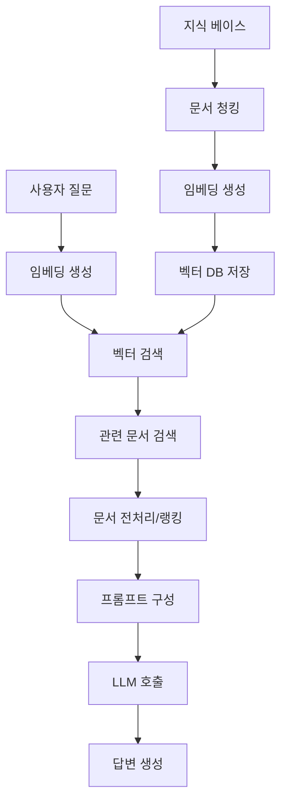

# RAG 시스템 설계: 음식 레시피 RAG 구현 고민

이전 글에서 Elasticsearch의 vector 필드와 임베딩 검색을 다뤘는데, 이번에는 이러한 벡터 검색을 활용한 **RAG(Retrieval-Augmented Generation) 시스템**을 설계하는 방법과, 실제로 **음식 레시피 도메인**에 적용할 때의 고민을 정리해보겠습니다.

RAG는 LLM(Large Language Model)의 환각(Hallucination) 문제를 해결하고, 도메인 특화 지식을 제공하기 위한 핵심 패턴입니다. 하지만 단순히 "벡터 DB에 넣고 검색해서 LLM에 전달"하는 것이 전부는 아닙니다.

---

## 1. RAG란 무엇인가?

### 개념

**RAG(Retrieval-Augmented Generation)**는 **외부 지식 베이스에서 관련 정보를 검색(Retrieval)하여 LLM의 생성(Generation)을 보강(Augment)**하는 패턴입니다.

```
사용자 질문
    ↓
[벡터 검색] → 관련 문서 검색
    ↓
[LLM] → 검색된 문서 + 질문 → 답변 생성
```

### 왜 RAG가 필요한가?

**LLM의 한계:**
- ❌ 학습 시점 이후의 정보를 모름
- ❌ 특정 도메인의 상세한 지식을 정확히 기억하지 못함
- ❌ 환각(Hallucination): 존재하지 않는 정보를 만들어냄

**RAG의 해결책:**
- ✅ 외부 지식 베이스를 실시간으로 검색
- ✅ 도메인 특화 지식을 벡터 검색으로 제공
- ✅ 검색된 문서를 기반으로 답변 생성 → 환각 감소

---

## 2. RAG 시스템의 기본 구조

### 2.1 전체 아키텍처



### 2.2 핵심 컴포넌트

1. **지식 베이스 (Knowledge Base)**
   - 원본 문서 저장소 (Markdown, PDF, HTML 등)

2. **임베딩 생성 (Embedding Generation)**
   - 문서를 벡터로 변환 (OpenAI, HuggingFace 모델 등)

3. **벡터 저장소 (Vector Store)**
   - Elasticsearch, Pinecone, Weaviate, Chroma 등

4. **검색 엔진 (Retrieval Engine)**
   - 벡터 검색 (kNN), 하이브리드 검색 (키워드 + 벡터)

5. **LLM (Large Language Model)**
   - GPT-4, Claude, Llama 등

---

## 3. 음식 레시피 RAG 설계 고민

음식 레시피 도메인에 RAG를 적용할 때 고려해야 할 사항들을 정리해보겠습니다.

### 3.1 데이터 구조 설계

#### 문제: 레시피 데이터의 복잡성

레시피는 단순한 텍스트가 아닙니다:
- **재료 목록** (이름, 양, 단위)
- **조리 단계** (순서, 시간, 온도)
- **영양 정보** (칼로리, 탄수화물, 단백질 등)
- **태그** (한식, 양식, 비건, 매운맛 등)
- **이미지** (완성 사진, 과정 사진)

#### 설계 고민 1: 청킹(Chunking) 전략

**옵션 A: 전체 레시피를 하나의 청크로**
```
장점: 레시피의 전체 맥락 유지
단점: 검색 시 불필요한 정보도 함께 반환
```

**옵션 B: 재료/조리법/영양정보로 분리**
```
장점: 세밀한 검색 가능
단점: 맥락 분리로 인한 정보 손실
```

**옵션 C: 하이브리드 (메타데이터 + 청크)**
```json
{
  "recipe_id": "recipe_001",
  "title": "김치찌개",
  "metadata": {
    "cuisine": "한식",
    "spicy_level": 3,
    "cooking_time": 30,
    "servings": 2
  },
  "chunks": [
    {
      "type": "ingredients",
      "content": "돼지고기 200g, 김치 300g, ...",
      "embedding": [0.1, 0.2, ...]
    },
    {
      "type": "instructions",
      "content": "1. 돼지고기를 볶는다. 2. 김치를 넣고 볶는다. ...",
      "embedding": [0.3, 0.4, ...]
    }
  ]
}
```

**추천: 옵션 C (하이브리드)**
- 메타데이터로 필터링 (한식, 매운맛 등)
- 청크로 세밀한 검색 (특정 재료, 조리법)

#### 설계 고민 2: 임베딩 모델 선택

**음식 레시피 도메인 특성:**
- 한국어 레시피 → 한국어 임베딩 모델 필요
- 요리 용어 (볶기, 끓이기, 데치기 등) → 도메인 특화 모델 고려

**옵션:**
1. **일반 한국어 모델**: `sentence-transformers/paraphrase-multilingual-MiniLM-L12-v2`
2. **도메인 특화 모델**: 요리/레시피 데이터로 fine-tuning
3. **멀티모달 모델**: 텍스트 + 이미지 임베딩 (레시피 이미지 활용)

**추천:**
- MVP: 일반 한국어 모델로 시작
- 개선: 레시피 데이터로 fine-tuning 또는 도메인 특화 모델 사용

### 3.2 검색 전략 설계

#### 문제: 다양한 검색 시나리오

사용자 질문 유형:
1. **"김치찌개 만드는 법"** → 전체 레시피 검색
2. **"돼지고기 없이 김치찌개 만들 수 있어?"** → 재료 대체 검색
3. **"30분 안에 만들 수 있는 한식"** → 메타데이터 필터링
4. **"매운 음식 추천해줘"** → 태그 기반 검색

#### 설계 고민 3: 하이브리드 검색 전략

**단계 1: 의도 분류 (Intent Classification)**
```java
public enum RecipeIntent {
    FULL_RECIPE,      // 전체 레시피 요청
    INGREDIENT_SUB,   // 재료 대체 요청
    FILTER_BASED,     // 메타데이터 필터링
    RECOMMENDATION    // 추천 요청
}
```

**단계 2: 검색 전략 선택**
```java
public class RecipeRAGService {
    
    public List<Recipe> search(String query, RecipeIntent intent) {
        switch (intent) {
            case FULL_RECIPE:
                // 벡터 검색으로 유사 레시피 검색
                return vectorSearch(query);
                
            case INGREDIENT_SUB:
                // 재료 필터링 + 벡터 검색
                return filterByIngredients(query) + vectorSearch(query);
                
            case FILTER_BASED:
                // 메타데이터 필터링 + 키워드 검색
                return filterByMetadata(query) + keywordSearch(query);
                
            case RECOMMENDATION:
                // 태그 기반 + 벡터 검색
                return tagBasedSearch(query) + vectorSearch(query);
        }
    }
}
```

**추천: 다단계 검색 파이프라인**
1. 메타데이터 필터링 (Elasticsearch 필터)
2. 벡터 검색 (의미 기반)
3. 키워드 검색 (정확한 매칭)
4. RRF (Reciprocal Rank Fusion)로 결과 통합

### 3.3 프롬프트 설계

#### 문제: 레시피 정보를 LLM에 어떻게 전달할까?

**옵션 A: 단순 연결**
```
프롬프트: "다음 레시피를 참고하여 질문에 답하세요.\n{레시피 텍스트}\n\n질문: {사용자 질문}"
```

**옵션 B: 구조화된 형식**
```
프롬프트: """
레시피 정보:
- 제목: {title}
- 재료: {ingredients}
- 조리법: {instructions}
- 영양정보: {nutrition}

질문: {user_query}

위 정보를 바탕으로 답변하세요.
"""
```

**옵션 C: Few-shot 예시 포함**
```
프롬프트: """
레시피 정보:
{recipe_info}

질문 예시:
Q: "이 레시피에서 돼지고기를 대체할 수 있어?"
A: "네, 돼지고기 대신 닭고기나 두부를 사용할 수 있습니다. ..."

실제 질문: {user_query}
"""
```

**추천: 옵션 B + C (구조화 + 예시)**
- 구조화된 형식으로 LLM이 정보를 쉽게 파싱
- Few-shot 예시로 원하는 답변 형식 유도

### 3.4 실전 구현 예시

```java
@Service
public class RecipeRAGService {
    
    private final ElasticsearchClient esClient;
    private final EmbeddingService embeddingService;
    private final LLMService llmService;
    
    public String answer(String userQuery) {
        // 1. 사용자 질문을 임베딩으로 변환
        float[] queryEmbedding = embeddingService.embed(userQuery);
        
        // 2. 벡터 검색 (kNN)
        List<RecipeChunk> chunks = searchSimilarRecipes(queryEmbedding, 5);
        
        // 3. 메타데이터 필터링 (필요 시)
        chunks = filterByMetadata(chunks, userQuery);
        
        // 4. 프롬프트 구성
        String prompt = buildPrompt(chunks, userQuery);
        
        // 5. LLM 호출
        return llmService.generate(prompt);
    }
    
    private List<RecipeChunk> searchSimilarRecipes(float[] embedding, int topK) {
        // Elasticsearch kNN 검색
        SearchRequest request = SearchRequest.of(s -> s
            .index("recipes")
            .knn(k -> k
                .field("embedding")
                .queryVector(embedding)
                .k(topK)
            )
        );
        
        SearchResponse<RecipeChunk> response = esClient.search(request, RecipeChunk.class);
        return response.hits().hits().stream()
            .map(hit -> hit.source())
            .collect(Collectors.toList());
    }
    
    private String buildPrompt(List<RecipeChunk> chunks, String userQuery) {
        StringBuilder prompt = new StringBuilder();
        prompt.append("다음 레시피 정보를 참고하여 질문에 답하세요.\n\n");
        
        for (RecipeChunk chunk : chunks) {
            prompt.append(String.format("""
                레시피: %s
                재료: %s
                조리법: %s
                ---
                """, 
                chunk.getTitle(),
                chunk.getIngredients(),
                chunk.getInstructions()
            ));
        }
        
        prompt.append(String.format("\n질문: %s\n답변:", userQuery));
        return prompt.toString();
    }
}
```

---

## 4. RAG 시스템의 주요 고민사항

### 4.1 청킹(Chunking) 전략

**문제: 문서를 어떻게 나눌 것인가?**

**고려사항:**
- 청크 크기: 너무 작으면 맥락 손실, 너무 크면 검색 정확도 저하
- 청크 오버랩: 경계 정보 손실 방지
- 도메인 특성: 레시피는 순서가 중요 → 순서 정보 보존

**추천:**
- 청크 크기: 200-500 토큰
- 오버랩: 50-100 토큰
- 레시피는 "재료" + "조리법"을 별도 청크로 관리

### 4.2 검색 품질 개선

**문제: 검색된 문서가 질문과 관련이 없을 수 있음**

**해결책:**
1. **Re-ranking**: 검색 결과를 LLM으로 재랭킹
2. **하이브리드 검색**: 벡터 + 키워드 검색 결합
3. **필터링**: 메타데이터 기반 사전 필터링
4. **임계값 설정**: 유사도 점수가 낮으면 검색 결과 제외

### 4.3 LLM 응답 품질

**문제: LLM이 여전히 환각을 일으킬 수 있음**

**해결책:**
1. **프롬프트 엔지니어링**: "검색된 문서만 참고하라" 명시
2. **출력 검증**: 답변에 출처(레시피 ID) 포함 요구
3. **Few-shot 예시**: 원하는 답변 형식 유도
4. **Temperature 조정**: 창의성 vs 정확도 균형

### 4.4 성능 최적화

**문제: 임베딩 생성 + 검색 + LLM 호출 = 느림**

**해결책:**
1. **비동기 처리**: 임베딩 생성과 검색을 병렬 처리
2. **캐싱**: 자주 묻는 질문의 답변 캐싱
3. **임베딩 캐싱**: 동일한 문서의 임베딩 재사용
4. **스트리밍**: LLM 응답을 스트리밍으로 전달

---

## 5. 음식 레시피 RAG의 특수 고민

### 5.1 재료 대체 검색

**시나리오: "돼지고기 없이 김치찌개 만들 수 있어?"**

**고민:**
- 벡터 검색만으로는 "재료 대체" 의도를 파악하기 어려움
- 재료 간 유사도 매트릭스 필요 (돼지고기 ↔ 닭고기 ↔ 두부)

**해결책:**
```java
// 재료 유사도 그래프
Map<String, List<String>> ingredientSubstitutes = Map.of(
    "돼지고기", List.of("닭고기", "두부", "콩고기"),
    "우유", List.of("두유", "코코넛밀크", "오트밀크")
);

// 검색 시 재료 필터링 + 대체 재료 검색
public List<Recipe> searchWithSubstitution(String query) {
    // 1. 원래 재료로 검색
    List<Recipe> recipes = searchByIngredients(extractIngredients(query));
    
    // 2. 대체 재료로도 검색
    List<String> substitutes = findSubstitutes(extractIngredients(query));
    recipes.addAll(searchByIngredients(substitutes));
    
    return deduplicate(recipes);
}
```

### 5.2 조리 시간/난이도 필터링

**시나리오: "30분 안에 만들 수 있는 한식"**

**고민:**
- 메타데이터 필터링이 벡터 검색보다 우선되어야 함
- 조리 시간은 숫자 범위 검색 필요

**해결책:**
```java
// Elasticsearch 쿼리 예시
BoolQuery.Builder boolQuery = new BoolQuery.Builder();

// 메타데이터 필터 (조리 시간)
boolQuery.filter(f -> f
    .range(r -> r
        .field("cooking_time")
        .lte(JsonData.of(30))
    )
);

// 메타데이터 필터 (한식)
boolQuery.filter(f -> f
    .term(t -> t
        .field("cuisine")
        .value("한식")
    )
);

// 벡터 검색 (의미 기반)
boolQuery.must(m -> m
    .knn(k -> k
        .field("embedding")
        .queryVector(queryEmbedding)
        .k(10)
    )
);
```

### 5.3 이미지 기반 검색

**시나리오: "이 사진처럼 생긴 음식 레시피 알려줘"**

**고민:**
- 텍스트만으로는 시각적 유사도 검색 불가
- 멀티모달 임베딩 필요 (텍스트 + 이미지)

**해결책:**
- CLIP 모델 사용: 이미지와 텍스트를 같은 벡터 공간에 매핑
- 이미지 임베딩을 Elasticsearch에 저장
- 사용자가 업로드한 이미지의 임베딩으로 검색

---

## 6. RAG 시스템 모니터링

### 6.1 핵심 메트릭

1. **검색 품질**
   - 검색된 문서의 유사도 점수 분포
   - 검색 결과의 다양성 (Diversity)

2. **LLM 응답 품질**
   - 사용자 만족도 (피드백)
   - 답변 정확도 (출처 검증)

3. **성능**
   - 검색 지연 시간 (P50, P95, P99)
   - LLM 응답 시간
   - 전체 RAG 파이프라인 지연 시간

4. **비용**
   - 임베딩 생성 비용 (토큰 수)
   - LLM 호출 비용 (토큰 수)
   - 벡터 DB 저장/검색 비용

### 6.2 A/B 테스트

- **청킹 전략 비교**: 전체 vs 분리 청킹
- **검색 전략 비교**: 벡터만 vs 하이브리드
- **프롬프트 비교**: 단순 vs 구조화 vs Few-shot

---

## 마무리

**핵심 포인트:**

- **RAG는 단순히 "벡터 검색 + LLM"이 아니라, 도메인 특성을 반영한 설계가 필요합니다.**
- **음식 레시피 RAG에서는 청킹 전략, 검색 전략, 프롬프트 설계가 핵심입니다.**
- **재료 대체, 조리 시간 필터링, 이미지 기반 검색 등 도메인 특화 기능을 고려해야 합니다.**
- **검색 품질, LLM 응답 품질, 성능, 비용을 지속적으로 모니터링하고 개선해야 합니다.**

RAG 시스템은 **검색(Retrieval)의 품질**이 **생성(Generation)의 품질**을 좌우하므로, 벡터 검색 엔진과 프롬프트 엔지니어링에 집중해야 합니다.

다음 글에서는 RAG 시스템의 백엔드 구현과 관련하여 **Spring의 in-process 처리와 ThreadPoolTaskExecutor**를 활용한 비동기 처리 전략을 정리해보겠습니다. 🚀


