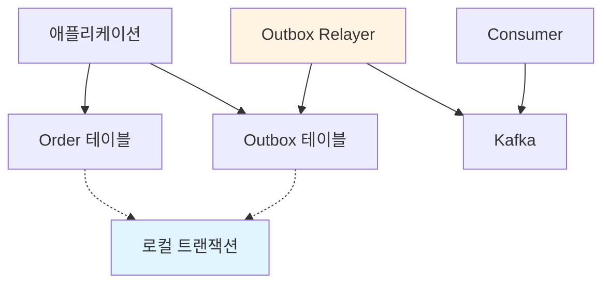

# Outbox 패턴: DB 트랜잭션과 Kafka 메시지 발행의 일관성 보장

이전 글에서 Saga Pattern과 Kafka를 활용한 분산 트랜잭션 처리를 다뤘는데, 이번에는 **Outbox 패턴**을 통해 **DB 트랜잭션과 Kafka 메시지 발행 간의 일관성을 보장**하는 방법을 정리해보겠습니다.

Saga Pattern을 구현할 때 가장 큰 문제 중 하나는 **"DB 트랜잭션은 성공했는데 Kafka 메시지 발행이 실패하면 어떻게 할 것인가?"**입니다. 

Outbox 패턴은 이 문제를 해결하는 핵심 패턴이며, 실제 프로덕션 환경에서 널리 사용되고 있습니다.

---

## 1. 문제 상황: DB와 메시지 브로커 간 일관성

### 1.1 전형적인 문제 시나리오

```java
@Service
@Transactional
public class OrderService {
    
    public void createOrder(OrderRequest request) {
        // 1. 주문 데이터를 DB에 저장
        Order order = new Order(request);
        orderRepository.save(order);
        
        // 2. Kafka에 이벤트 발행
        kafkaTemplate.send("order-created", orderCreatedEvent);
        
        // ❌ 문제: 만약 여기서 예외가 발생하면?
        // - DB는 이미 커밋됨 (트랜잭션 완료)
        // - Kafka 메시지는 발행되지 않음
        // - 다른 서비스는 주문 생성 사실을 모름
    }
}
```

**문제점:**
- DB 트랜잭션과 Kafka 메시지 발행이 **원자적(Atomic)이지 않음**
- DB는 커밋되었지만 Kafka 메시지 발행이 실패할 수 있음
- 반대로 Kafka 메시지는 발행되었지만 DB 롤백될 수 있음

### 1.2 2PC(Two-Phase Commit)의 한계

**2PC를 사용하면?**
- ✅ 원자성 보장 가능
- ❌ 성능 저하 (동기적 처리)
- ❌ 메시지 브로커가 2PC를 지원해야 함 (Kafka는 지원하지 않음)
- ❌ 분산 시스템에서 실패 지점이 많아짐

**결론: 2PC는 현실적이지 않음**

---

## 2. Outbox 패턴의 개념

### 2.1 기본 아이디어

**Outbox 패턴**은 **로컬 DB 트랜잭션 안에서 비즈니스 데이터와 이벤트 레코드를 함께 저장**하는 방식입니다.

```
[로컬 트랜잭션]
1. Order 테이블 INSERT
2. Outbox 테이블 INSERT (이벤트 정보)
   → COMMIT (원자적 보장)

[별도 프로세스]
3. Outbox 테이블 폴링
4. Kafka로 이벤트 발행
5. 발행 성공 시 Outbox 레코드 삭제 또는 상태 업데이트
```

### 2.2 아키텍처 다이어그램



### 2.3 핵심 원리

1. **로컬 트랜잭션으로 일관성 보장**
   - Order 테이블과 Outbox 테이블을 같은 트랜잭션에서 저장
   - 둘 다 성공하거나 둘 다 실패 (ACID 보장)

2. **비동기 이벤트 발행**
   - 별도 프로세스(Relayer)가 Outbox 테이블을 폴링
   - Kafka로 이벤트 발행 후 Outbox 레코드 처리

3. **최소 한 번 발행 보장 (At-Least-Once)**
   - Outbox 레코드가 있으면 계속 재시도
   - 중복 발행 가능성 있음 → Consumer에서 Idempotency 처리 필요

---

## 3. Outbox 패턴 구현

### 3.1 데이터베이스 스키마

```sql
-- Order 테이블
CREATE TABLE orders (
    id BIGINT PRIMARY KEY,
    user_id BIGINT NOT NULL,
    total_amount DECIMAL(10, 2) NOT NULL,
    status VARCHAR(50) NOT NULL,
    created_at TIMESTAMP NOT NULL
);

-- Outbox 테이블
CREATE TABLE outbox (
    id BIGINT PRIMARY KEY AUTO_INCREMENT,
    aggregate_type VARCHAR(255) NOT NULL,  -- 'Order', 'Payment' 등
    aggregate_id VARCHAR(255) NOT NULL,    -- Order ID
    event_type VARCHAR(255) NOT NULL,      -- 'OrderCreated', 'OrderCancelled' 등
    payload TEXT NOT NULL,                  -- JSON 형태의 이벤트 데이터
    status VARCHAR(50) NOT NULL DEFAULT 'PENDING',  -- 'PENDING', 'SENT', 'FAILED'
    created_at TIMESTAMP NOT NULL DEFAULT CURRENT_TIMESTAMP,
    sent_at TIMESTAMP NULL,
    INDEX idx_status_created (status, created_at)  -- 폴링 성능 최적화
);
```

### 3.2 서비스 레이어 구현

```java
@Service
@Transactional
public class OrderService {
    
    private final OrderRepository orderRepository;
    private final OutboxRepository outboxRepository;
    
    public void createOrder(OrderRequest request) {
        // 1. 주문 생성
        Order order = new Order(
            request.getUserId(),
            request.getTotalAmount()
        );
        orderRepository.save(order);
        
        // 2. Outbox에 이벤트 저장 (같은 트랜잭션)
        OrderCreatedEvent event = OrderCreatedEvent.builder()
            .orderId(order.getId())
            .userId(order.getUserId())
            .totalAmount(order.getTotalAmount())
            .createdAt(order.getCreatedAt())
            .build();
        
        Outbox outbox = Outbox.builder()
            .aggregateType("Order")
            .aggregateId(String.valueOf(order.getId()))
            .eventType("OrderCreated")
            .payload(objectMapper.writeValueAsString(event))
            .status(OutboxStatus.PENDING)
            .build();
        
        outboxRepository.save(outbox);
        
        // 3. 트랜잭션 커밋
        // → Order와 Outbox가 함께 저장됨 (원자적 보장)
    }
}
```

### 3.3 Outbox Relayer 구현

**폴링 방식:**

```java
@Component
@Slf4j
public class OutboxRelayer {
    
    private final OutboxRepository outboxRepository;
    private final KafkaTemplate<String, String> kafkaTemplate;
    private final ObjectMapper objectMapper;
    
    @Scheduled(fixedDelay = 1000)  // 1초마다 폴링
    public void relayEvents() {
        // PENDING 상태인 Outbox 레코드 조회
        List<Outbox> pendingEvents = outboxRepository
            .findByStatusOrderByCreatedAtAsc(OutboxStatus.PENDING, 100);
        
        for (Outbox outbox : pendingEvents) {
            try {
                // Kafka로 이벤트 발행
                String topic = getTopicForEventType(outbox.getEventType());
                kafkaTemplate.send(topic, outbox.getAggregateId(), outbox.getPayload())
                    .addCallback(
                        result -> {
                            // 발행 성공 → 상태 업데이트
                            outbox.setStatus(OutboxStatus.SENT);
                            outbox.setSentAt(LocalDateTime.now());
                            outboxRepository.save(outbox);
                        },
                        failure -> {
                            // 발행 실패 → 로깅 (다음 폴링에서 재시도)
                            log.error("Failed to send event: {}", outbox.getId(), failure);
                        }
                    );
            } catch (Exception e) {
                log.error("Error processing outbox event: {}", outbox.getId(), e);
            }
        }
    }
    
    private String getTopicForEventType(String eventType) {
        return switch (eventType) {
            case "OrderCreated" -> "order-created";
            case "OrderCancelled" -> "order-cancelled";
            default -> "default-events";
        };
    }
}
```

**트랜잭션 로그 테이블 방식 (더 효율적):**

```java
@Component
@Slf4j
public class OutboxRelayer {
    
    @Scheduled(fixedDelay = 1000)
    public void relayEvents() {
        // 마지막 처리한 ID 이후의 레코드만 조회
        Long lastProcessedId = getLastProcessedId();
        List<Outbox> newEvents = outboxRepository
            .findByIdGreaterThanAndStatusOrderByIdAsc(lastProcessedId, OutboxStatus.PENDING, 100);
        
        for (Outbox outbox : newEvents) {
            try {
                sendToKafka(outbox);
                updateLastProcessedId(outbox.getId());
            } catch (Exception e) {
                log.error("Error processing outbox event: {}", outbox.getId(), e);
                break;  // 실패 시 중단 (다음 폴링에서 재시도)
            }
        }
    }
}
```

### 3.4 Spring Boot 설정

```java
@Configuration
@EnableScheduling
public class OutboxConfig {
    
    @Bean
    public TaskScheduler outboxTaskScheduler() {
        ThreadPoolTaskScheduler scheduler = new ThreadPoolTaskScheduler();
        scheduler.setPoolSize(1);  // 단일 스레드로 순차 처리
        scheduler.setThreadNamePrefix("outbox-relayer-");
        scheduler.initialize();
        return scheduler;
    }
}
```

---

## 4. CDC(Change Data Capture)와의 비교

### 4.1 CDC 방식

**CDC(Change Data Capture)**는 **데이터베이스의 변경 사항을 자동으로 감지하여 이벤트로 변환**하는 방식입니다.

**예시: Debezium (Kafka Connect)**

```yaml
# Debezium Connector 설정
connector.class: io.debezium.connector.mysql.MySqlConnector
database.hostname: mysql
database.port: 3306
database.user: debezium
database.password: password
database.server.id: 184054
database.server.name: mysql-server
table.whitelist: orders_db.orders
```

**동작 방식:**
1. MySQL의 binlog를 읽어서 변경 사항 감지
2. 변경 사항을 Kafka 이벤트로 변환
3. 자동으로 Kafka에 발행

### 4.2 Outbox vs CDC 비교

| 구분 | Outbox 패턴 | CDC (Debezium) |
|------|------------|----------------|
| **구현 복잡도** | 중간 (Outbox 테이블 + Relayer) | 낮음 (설정만으로 가능) |
| **인프라 요구사항** | 낮음 (애플리케이션 내부) | 높음 (Kafka Connect, Debezium) |
| **이벤트 형식 제어** | 높음 (애플리케이션에서 정의) | 낮음 (DB 스키마 기반) |
| **성능** | 중간 (폴링 오버헤드) | 높음 (binlog 스트리밍) |
| **지연 시간** | 높음 (폴링 주기에 따라) | 낮음 (실시간) |
| **DB 부하** | 중간 (SELECT 쿼리) | 낮음 (binlog 읽기) |
| **이벤트 필터링** | 쉬움 (애플리케이션 로직) | 어려움 (설정 기반) |
| **트랜잭션 경계** | 명확함 (애플리케이션 제어) | 불명확함 (binlog 기반) |

### 4.3 언제 무엇을 선택할까?

**Outbox 패턴이 적합한 경우:**
- ✅ 이벤트 형식을 완전히 제어하고 싶을 때
- ✅ 인프라 구성이 간단해야 할 때
- ✅ 특정 이벤트만 선택적으로 발행하고 싶을 때
- ✅ 트랜잭션 경계가 명확해야 할 때

**CDC가 적합한 경우:**
- ✅ 실시간 이벤트 발행이 중요할 때
- ✅ 모든 DB 변경 사항을 이벤트로 변환하고 싶을 때
- ✅ 인프라 구성이 가능할 때
- ✅ 이벤트 형식이 DB 스키마와 유사해도 될 때

**하이브리드 접근:**
- Outbox 테이블에 이벤트 저장
- Debezium이 Outbox 테이블의 변경을 감지하여 Kafka로 발행
- → 폴링 오버헤드 제거 + 이벤트 형식 제어 유지

---

## 5. 실전 고려사항

### 5.1 중복 발행 방지 (Idempotency)

**문제:**
- Outbox Relayer가 실패 후 재시도할 때 중복 발행 가능
- 네트워크 오류로 인한 중복 발행 가능

**해결책: Consumer에서 Idempotency 처리**

```java
@Component
@Slf4j
public class OrderCreatedConsumer {
    
    private final Set<String> processedEventIds = new ConcurrentHashMap<>().keySet();
    
    @KafkaListener(topics = "order-created")
    public void handleOrderCreated(String eventJson) {
        OrderCreatedEvent event = objectMapper.readValue(eventJson, OrderCreatedEvent.class);
        
        // Idempotency 체크
        String eventId = generateEventId(event);
        if (processedEventIds.contains(eventId)) {
            log.warn("Duplicate event detected: {}", eventId);
            return;  // 이미 처리한 이벤트는 무시
        }
        
        // 이벤트 처리
        processOrderCreated(event);
        
        // 처리 완료 표시
        processedEventIds.add(eventId);
    }
    
    private String generateEventId(OrderCreatedEvent event) {
        return event.getOrderId() + "-" + event.getCreatedAt();
    }
}
```

**더 나은 방법: DB에 처리 이벤트 ID 저장**

```java
@Entity
@Table(name = "processed_events")
public class ProcessedEvent {
    @Id
    private String eventId;
    private LocalDateTime processedAt;
}

// Consumer에서
@Transactional
public void handleOrderCreated(String eventJson) {
    OrderCreatedEvent event = parseEvent(eventJson);
    String eventId = generateEventId(event);
    
    // 이미 처리한 이벤트인지 확인
    if (processedEventRepository.existsById(eventId)) {
        return;
    }
    
    // 이벤트 처리
    processOrderCreated(event);
    
    // 처리 완료 기록
    processedEventRepository.save(new ProcessedEvent(eventId, LocalDateTime.now()));
}
```

### 5.2 폴링 주기 최적화

**문제:**
- 폴링 주기가 짧으면 DB 부하 증가
- 폴링 주기가 길면 이벤트 발행 지연 증가

**해결책: 적응형 폴링**

```java
@Component
public class AdaptiveOutboxRelayer {
    
    private long pollingInterval = 1000;  // 초기값: 1초
    
    @Scheduled(fixedDelayString = "${outbox.polling.interval:1000}")
    public void relayEvents() {
        List<Outbox> events = findPendingEvents();
        
        if (events.isEmpty()) {
            // 이벤트가 없으면 폴링 주기 증가
            pollingInterval = Math.min(pollingInterval * 2, 10000);  // 최대 10초
        } else {
            // 이벤트가 많으면 폴링 주기 감소
            pollingInterval = Math.max(pollingInterval / 2, 100);  // 최소 100ms
        }
        
        processEvents(events);
    }
}
```

### 5.3 배치 처리

**여러 이벤트를 한 번에 처리:**

```java
@Scheduled(fixedDelay = 1000)
public void relayEvents() {
    List<Outbox> events = findPendingEvents(100);  // 최대 100개
    
    // 이벤트를 타입별로 그룹화
    Map<String, List<Outbox>> eventsByType = events.stream()
        .collect(Collectors.groupingBy(Outbox::getEventType));
    
    // 타입별로 배치 발행
    for (Map.Entry<String, List<Outbox>> entry : eventsByType.entrySet()) {
        String topic = getTopicForEventType(entry.getKey());
        List<Outbox> batch = entry.getValue();
        
        // Kafka Producer의 배치 기능 활용
        for (Outbox outbox : batch) {
            kafkaTemplate.send(topic, outbox.getAggregateId(), outbox.getPayload());
        }
        
        // 배치 완료 후 상태 업데이트
        kafkaTemplate.flush();
        updateStatusToSent(batch);
    }
}
```

### 5.4 실패 처리 및 재시도

```java
@Component
public class OutboxRelayer {
    
    private static final int MAX_RETRIES = 3;
    
    public void relayEvents() {
        List<Outbox> events = findPendingEvents();
        
        for (Outbox outbox : events) {
            try {
                sendToKafka(outbox);
                markAsSent(outbox);
            } catch (Exception e) {
                handleFailure(outbox, e);
            }
        }
    }
    
    private void handleFailure(Outbox outbox, Exception e) {
        int retryCount = outbox.getRetryCount() != null ? outbox.getRetryCount() : 0;
        
        if (retryCount < MAX_RETRIES) {
            // 재시도 가능
            outbox.setRetryCount(retryCount + 1);
            outbox.setLastError(e.getMessage());
            outboxRepository.save(outbox);
            
            log.warn("Event {} failed, will retry. Retry count: {}", 
                outbox.getId(), retryCount + 1);
        } else {
            // 최대 재시도 횟수 초과 → 수동 처리 필요
            outbox.setStatus(OutboxStatus.FAILED);
            outbox.setLastError(e.getMessage());
            outboxRepository.save(outbox);
            
            log.error("Event {} failed after {} retries. Manual intervention required.", 
                outbox.getId(), MAX_RETRIES);
            
            // 알림 발송 (Slack, Email 등)
            alertService.sendAlert("Outbox event failed", outbox);
        }
    }
}
```

### 5.5 Outbox 테이블 정리

**발행 완료된 레코드 정리:**

```java
@Scheduled(cron = "0 0 2 * * *")  // 매일 새벽 2시
public void cleanupSentEvents() {
    LocalDateTime cutoffDate = LocalDateTime.now().minusDays(7);  // 7일 전
    
    // SENT 상태이고 7일 이상 지난 레코드 삭제
    outboxRepository.deleteByStatusAndSentAtBefore(
        OutboxStatus.SENT, 
        cutoffDate
    );
}
```

---

## 6. Spring Cloud Stream과의 통합

### 6.1 Spring Cloud Stream 사용

```java
@Service
public class OrderService {
    
    @Autowired
    private StreamBridge streamBridge;  // Spring Cloud Stream
    
    @Transactional
    public void createOrder(OrderRequest request) {
        Order order = new Order(request);
        orderRepository.save(order);
        
        // Outbox에 저장
        Outbox outbox = createOutbox(order);
        outboxRepository.save(outbox);
        
        // Spring Cloud Stream으로 발행 (선택적)
        // streamBridge.send("order-created", event);
    }
}

// Outbox Relayer에서 Spring Cloud Stream 사용
@Component
public class OutboxRelayer {
    
    @Autowired
    private StreamBridge streamBridge;
    
    @Scheduled(fixedDelay = 1000)
    public void relayEvents() {
        List<Outbox> events = findPendingEvents();
        
        for (Outbox outbox : events) {
            streamBridge.send(
                getBindingName(outbox.getEventType()),
                outbox.getPayload()
            );
            
            markAsSent(outbox);
        }
    }
}
```

---

## 7. 모니터링 및 관찰 가능성

### 7.1 핵심 메트릭

```java
@Component
public class OutboxMetrics {
    
    private final MeterRegistry meterRegistry;
    
    public void recordEventSent(String eventType) {
        meterRegistry.counter("outbox.events.sent", "type", eventType).increment();
    }
    
    public void recordEventFailed(String eventType) {
        meterRegistry.counter("outbox.events.failed", "type", eventType).increment();
    }
    
    public void recordProcessingTime(Duration duration) {
        meterRegistry.timer("outbox.processing.time").record(duration);
    }
    
    @Scheduled(fixedRate = 60000)  // 1분마다
    public void recordQueueSize() {
        long pendingCount = outboxRepository.countByStatus(OutboxStatus.PENDING);
        meterRegistry.gauge("outbox.queue.size", pendingCount);
    }
}
```

### 7.2 로깅

```java
@Component
@Slf4j
public class OutboxRelayer {
    
    @Scheduled(fixedDelay = 1000)
    public void relayEvents() {
        long startTime = System.currentTimeMillis();
        List<Outbox> events = findPendingEvents();
        
        log.info("Processing {} outbox events", events.size());
        
        int successCount = 0;
        int failureCount = 0;
        
        for (Outbox outbox : events) {
            try {
                sendToKafka(outbox);
                markAsSent(outbox);
                successCount++;
            } catch (Exception e) {
                failureCount++;
                log.error("Failed to process outbox event: {}", outbox.getId(), e);
            }
        }
        
        long duration = System.currentTimeMillis() - startTime;
        log.info("Outbox processing completed. Success: {}, Failed: {}, Duration: {}ms", 
            successCount, failureCount, duration);
    }
}
```

---

## 8. 실전 예제: 완전한 구현

### 8.1 전체 구조

```java
// 1. Outbox Entity
@Entity
@Table(name = "outbox")
public class Outbox {
    @Id
    @GeneratedValue(strategy = GenerationType.IDENTITY)
    private Long id;
    
    private String aggregateType;
    private String aggregateId;
    private String eventType;
    
    @Column(columnDefinition = "TEXT")
    private String payload;
    
    @Enumerated(EnumType.STRING)
    private OutboxStatus status = OutboxStatus.PENDING;
    
    private Integer retryCount = 0;
    private String lastError;
    
    private LocalDateTime createdAt = LocalDateTime.now();
    private LocalDateTime sentAt;
}

// 2. Service Layer
@Service
@Transactional
public class OrderService {
    
    public void createOrder(OrderRequest request) {
        Order order = saveOrder(request);
        saveOutboxEvent(order, "OrderCreated");
    }
    
    private void saveOutboxEvent(Order order, String eventType) {
        OrderCreatedEvent event = OrderCreatedEvent.from(order);
        Outbox outbox = Outbox.builder()
            .aggregateType("Order")
            .aggregateId(String.valueOf(order.getId()))
            .eventType(eventType)
            .payload(objectMapper.writeValueAsString(event))
            .status(OutboxStatus.PENDING)
            .build();
        outboxRepository.save(outbox);
    }
}

// 3. Outbox Relayer
@Component
@Slf4j
public class OutboxRelayer {
    
    @Scheduled(fixedDelay = 1000)
    public void relayEvents() {
        List<Outbox> events = outboxRepository
            .findTop100ByStatusOrderByCreatedAtAsc(OutboxStatus.PENDING);
        
        for (Outbox outbox : events) {
            try {
                sendToKafka(outbox);
                markAsSent(outbox);
            } catch (Exception e) {
                handleFailure(outbox, e);
            }
        }
    }
    
    private void sendToKafka(Outbox outbox) {
        String topic = getTopicForEventType(outbox.getEventType());
        kafkaTemplate.send(topic, outbox.getAggregateId(), outbox.getPayload())
            .get(5, TimeUnit.SECONDS);  // 동기 대기 (타임아웃 5초)
    }
    
    private void markAsSent(Outbox outbox) {
        outbox.setStatus(OutboxStatus.SENT);
        outbox.setSentAt(LocalDateTime.now());
        outboxRepository.save(outbox);
    }
}
```

---

## 마무리

**핵심 포인트:**

- **Outbox 패턴은 DB 트랜잭션과 메시지 브로커 간의 일관성을 보장하는 핵심 패턴입니다.**
- **로컬 트랜잭션으로 비즈니스 데이터와 이벤트를 함께 저장하고, 별도 프로세스가 비동기로 메시지를 발행합니다.**
- **CDC(Debezium)와 비교하여 이벤트 형식 제어와 인프라 복잡도에서 장단점이 있습니다.**
- **중복 발행 방지(Idempotency), 폴링 최적화, 실패 처리, 모니터링이 실전에서 중요합니다.**

Outbox 패턴은 Saga Pattern과 함께 사용할 때 특히 강력하며, 분산 시스템에서 **트랜잭션 일관성을 유지하면서도 성능과 확장성을 확보**할 수 있는 실용적인 해결책입니다.

다음 글에서는 Outbox 패턴과 함께 고려해야 하는 **Idempotency(멱등성) 패턴**과 **재시도 전략**을 정리해볼 예정입니다. 🚀


